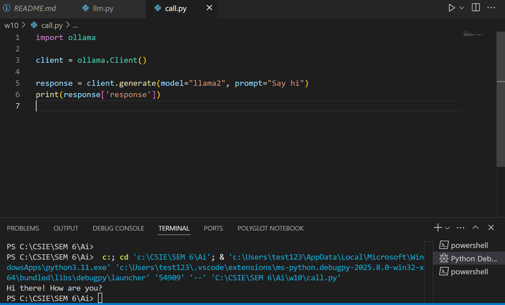

# call AI ​​model to make a sample program 
>參考老師範例修改, but i already have my own llama2 so i dont download a new one or the other one

I used ollama that is already installed in my computer, and try to run it in vscode. Here is the results: 

    
