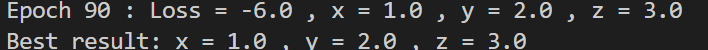

# Micrograd with function
> Did by self

minimize the following quadratic loss function:

\[
L = x^2 + y^2 + z^2 - 2x - 4y - 6z + 8
\]

## Results
I put the value to 0 for x yz and the results is as below:
  