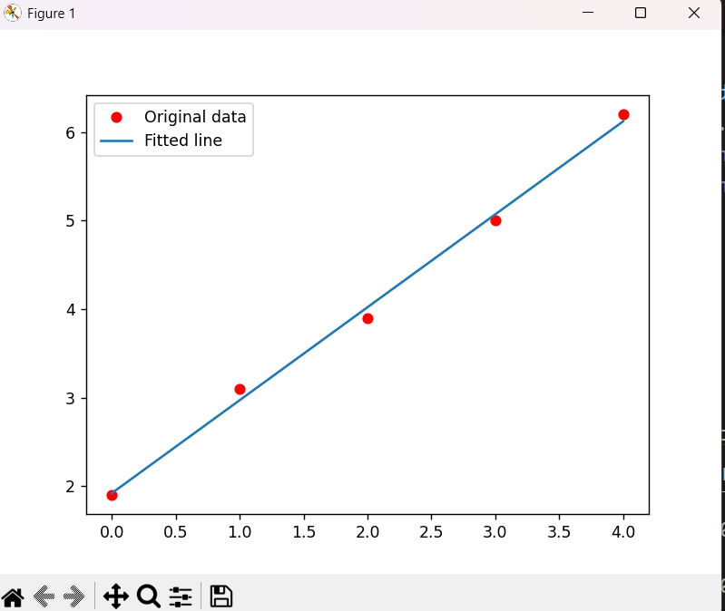

## Gradient Regression   
In gradient regression we need to make a loss function using MSE. At first I do it using micrograd and then once i finished doing it using micrograd, i proceed to do the torch version. Here is the result:    

   

```
loop 0, p = [0.0, 0.0], f(p) = 91.86999769687658, glen = 109.07795237686145
loop 100, p = [1.8532316083265103, 1.073421064993667], f(p) = 0.05047066774734733, glen = 0.21116596827594175
loop 200, p = [1.9167734590336105, 1.0511317872890493], f(p) = 0.04301736882485478, glen = 0.01020447832472191
loop 300, p = [1.9198440837348691, 1.0500546703034503], f(p) = 0.04299996349339673, glen = 0.0004931257566264935
loop 400, p = [1.9199924699708864, 1.0500026192223861], f(p) = 0.04299992284756108, glen = 2.3830028749724268e-05
loop 429, p = [1.9199968752321739, 1.0500010739401648], f(p) = 0.042999922768833305, glen = 9.897669806078612e-06
y_predicted= [1.9199968752321739, 2.9699979491723387, 4.019999023112503, 5.070000097052668, 6.1200011709928335]
```    
>We can see that the loss decreases and continued to decreases until loop 429 and stopped when the it goes below 0,000001. By loop 429, the parameters converged to p = [1.9199968752321739, 1.0500010739401648] resulting in a small loss value which is 0,043. The predicted y values closely match the actual y values, indicating that this regression model has been trained successfully.